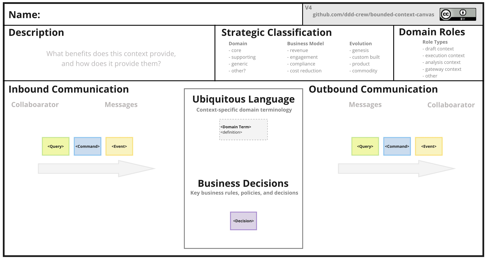
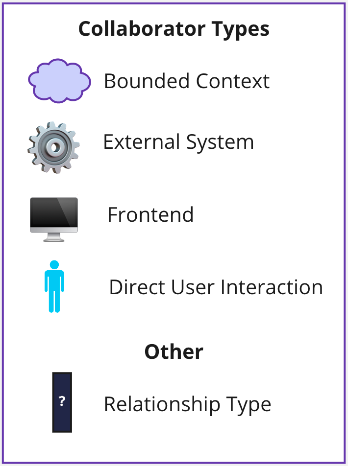
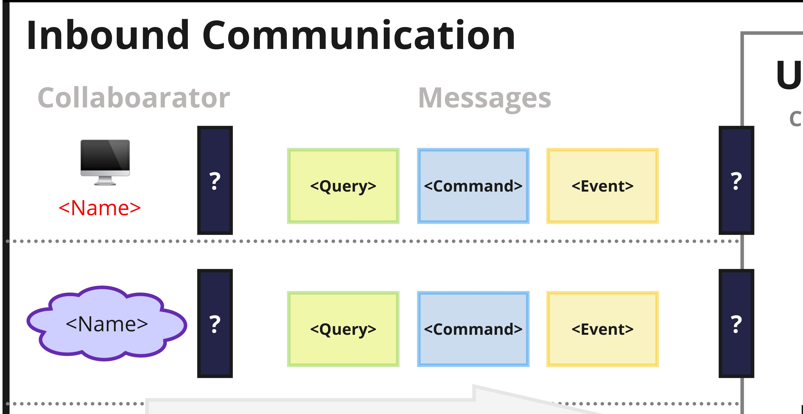

# The Bounded Context Canvas

The Bounded Context Canvas is a collaborative tool for designing and documenting the design of a single bounded context.

A [bounded context](https://martinfowler.com/bliki/BoundedContext.html) is a sub-system in a software architecture aligned to a part of your domain.

The canvas guides you through the process of designing a bounded context by requiring you to consider and make choices about the key elements of its design, from naming to responsibilities, to its public interface and dependencies.

## How to Use

>To quickly get started with the Bounded Context Canvas, complete the canvas in the order the sections are presented in [Section Definitions](#section-definitions)

Start with the name and description of the canvas to clarify its reason for existing and key responsibilities in a sentence or two. Then you can fill in the other sections of the canvas in any order. You could design outside-in starting with inbound communication or inside out starting with the business rules and domain language.

You may not have all the information you need to complete certain sections of the canvas. In such a case, you'll need to use other modelling techniques to find the information you require. See [DDD Toolbox](https://github.com/ddd-crew/ddd-toolbox) for suggestions.

## Section Definitions

Here is a short explanation of each section of the canvas.

### Name
Naming is hard. Writing down the name of your context and gaining agreement as a team will frame how you design the context.

### Description
A few sentences describing the why and what of the context in business language. No technical details here.

Writing down the description forces you to clearly articulate fuzzy thoughts and ensure everybody in the team is on the same page.

### Strategic Classification
How important is this context to the success of your organisation?: 

- core domain: a key strategic initiative
- supporting domain: necessary but not a differentiator
- generic: a common capability found in many domains

What role does the context play in your business model:

- revenue generator: people pay directly for this
- engagement creator: users like it but they don't pay for it
- compliance enforcer: protects your business reputation and existence

How evolved is the concept (see [Wardley Maps](https://medium.com/wardleymaps)):

- genesis: new unexplored domain
- custom built: companies are building their own versions
- product: off-the-shelf versions exist with differentiation
- commodity: highly-standardised versions exist

> For detailed descriptions of genesis, custom built, product, and commodity see [Wardley Maps Evolution definitions](https://twitter.com/swardley/status/989211014485901316/photo/1).

For help filling in this section of the canvas, see [Core Domain Charts](https://github.com/ddd-crew/core-domain-charts).

### Domain Roles
How can you characterise the behaviour of this bounded context? Does it receive high volumes of data and crunch them into insights - an analysis context? Or does it enforce a workflow - an execution context? Identifying the different roles a context plays can help to avoid coupling responsibilities.

Check out Alberto Brandolini's [Bounded Context Archetypes](http://cyrille.martraire.com/2012/09/collaborative-construction-by-alberto-brandolini/) and Rebecca Wirfs-Brock's [Object Role Stereotypes](http://www.wirfs-brock.com/PDFs/A_Brief-Tour-of-RDD.pdf) for a deeper analysis of this space. The [Model Traits worksheet](resources/model-traits-worksheet.md) contains community-generated examples of roles (model traits was the former name for domain roles).

### Inbound Communication

Inbound communication represents collaborations that are initiated by other collaborators.

#### Messages

Messages are the information that one collaborator sends to be another. There are three types of conversation that can occur between bounded contexts. A request to do something (a command), a request for some information (a query), or notification that something has happened (an event).

The word message is used in the general sense and not tied to any implementation. No message bus or asynchronous workflow is obligatory. A command, for example, could simply be posting data from an HTML form as a HTTP POST command.

#### Collaborators

Collaborators are other systems or sub-systems that send messages to this context. They can be other bounded contexts, frontends (web or mobile), or something else.

#### Relationship Type

The relationship type between two bounded contexts indicates how the models and teams influence each other. See [Context Mappping](https://github.com/ddd-crew/context-mapping) to learn about relationship types.

#### Organising Into Swimlanes

Collaborators can be organised into horizontal swim lanes showing the messages that they send.

### Outbound Communication

Outbound communication represents collaborations that are initiated by this context to interact with other collaborators. The same message types and notations apply as inbound communication.

### Ubiquitous Language
What are the key domain terms that exist within this context, and what do they mean?

### Business Decisions
What are the key business rules and policies within this context?

## Tools
Here are some tools that can hel you to use the Bounded Context Canvas.

### HTML Version
A [HTML version of the canvas](tools/html-version/instructions.md) you can edit in a browser and version in source control alongside your code. Contributed by [Nelson da Costa](https://github.com/baruica).

### Miro Version
An [interactive Miro whiteboard](https://github.com/ddd-crew/virtual-modelling-templates#strategic-ddd-miro-template) containing the Bounded Context Canvas and other DDD tools for collaborative modelling.

### draw.io Version
A [draw.io template of the canvas](tools/drawio-svg-version/instructions.md) containing the Bounded Context Canvas as template.

## Additional Resources

- [Bounded Context Canvas V3: Simplifications and Additions](https://medium.com/nick-tune-tech-strategy-blog/bounded-context-canvas-v2-simplifications-and-additions-229ed35f825f)

- [Extending the Bounded Context Canvas with BDD Examples](https://xebia.com/blog/extending-the-bounded-context-canvas-with-bdd-examples/)

## Contributors

Thank you to all [existing and future contributors](https://github.com/ddd-crew/bounded-context-canvas/graphs/contributors) and to the following individuals who have all contributed to the Bounded Context Canvas:

- [Kenny Baas](https://github.com/Baasie)
- [Kim Lindhard](https://github.com/kim-lindhard-dfds)
- [Michael Plöd](https://github.com/mploed)
- [Maxime Sanglan-Charlier](https://twitter.com/__maxs__)

A significant contribution to the Bounded Context Canvas was the inspiration of the [Business Model Canvas](https://www.strategyzer.com/canvas/business-model-canvas).

## Contributions and Feedback

The Bounded Context Canvas is freely available for you to use. In addition, your feedback and ideas are welcome to improve the canvas or to create new versions. 

Feel free to also send us a pull request with your examples.

[![CC BY 4.0][cc-by-shield]][cc-by]

This work is licensed under a [Creative Commons Attribution 4.0 International
License][cc-by].

[![CC BY 4.0][cc-by-image]][cc-by]

[cc-by]: http://creativecommons.org/licenses/by/4.0/
[cc-by-image]: https://i.creativecommons.org/l/by/4.0/88x31.png
[cc-by-shield]: https://img.shields.io/badge/License-CC%20BY%204.0-lightgrey.svg
