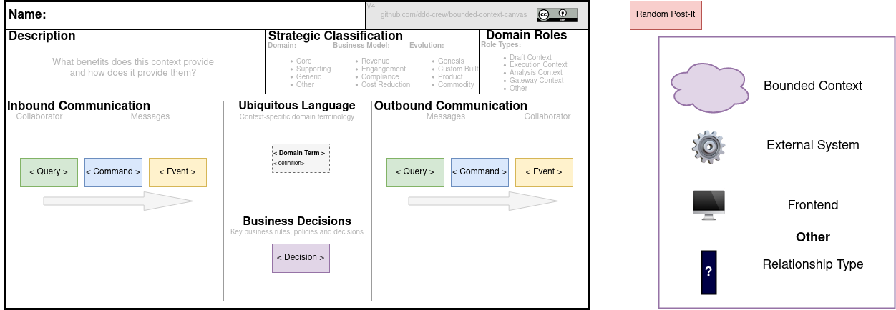

# Bounded Context Canvas how to

The *bounded context canvas* is described in [this blog post](https://medium.com/nick-tune-tech-strategy-blog/bounded-context-canvas-v2-simplifications-and-additions-229ed35f825f) by Nick Tune (highly recommended blog btw).

## Prerequisites

Install **Visual Studio Code** and the **draw.io extension**

- [VS Code](https://code.visualstudio.com/)
- [Draw.io Integration extension](https://marketplace.visualstudio.com/items?itemName=hediet.vscode-drawio)

It allows you to save the current page ([draw.io](https://www.diagrams.net/) SVG + data filled in) as an SVG file (which can live next to the bounded context's code).

Doing so allows one to re-open the saved SVG file and update the filled in data.

## How to

- Either continue from a canvas you already started or start from the `bounded-context-canvas-template.drawio.svg`.
- Fill it in with your team.
- Save the current file save it near the bounded context's code.