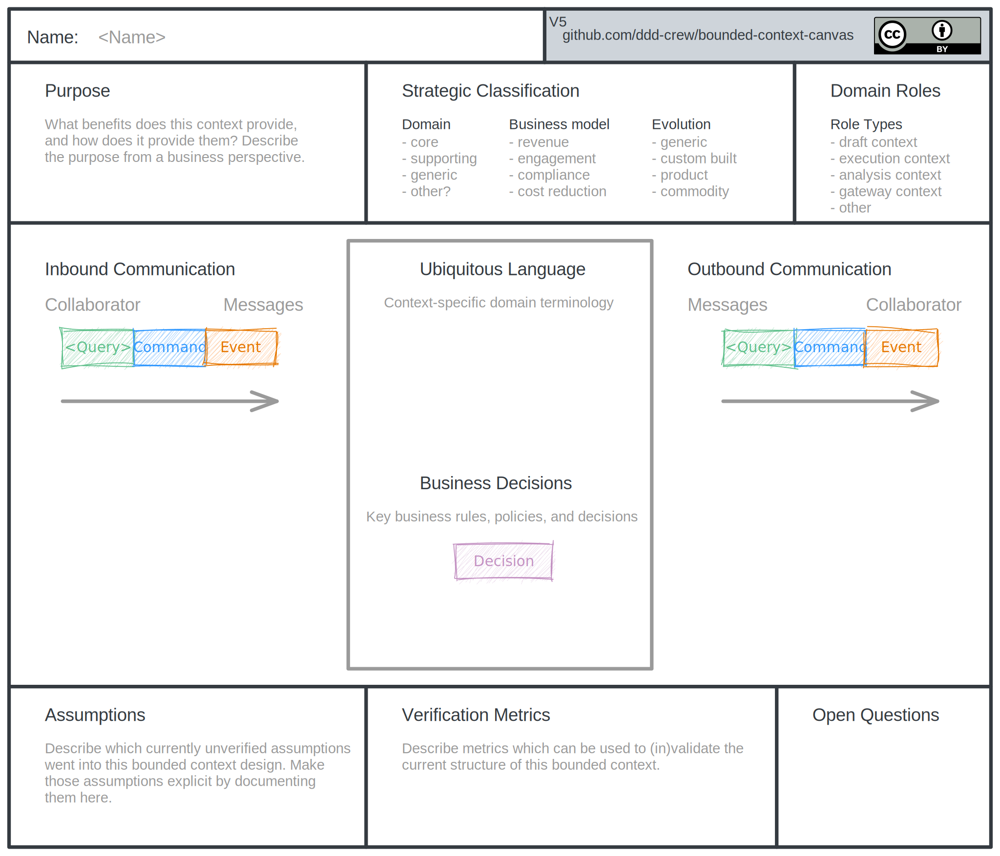

# Bounded Context Canvas how to

The *bounded context canvas* is described in [this blog post](https://medium.com/nick-tune-tech-strategy-blog/bounded-context-canvas-v2-simplifications-and-additions-229ed35f825f) by Nick Tune (highly recommended blog btw).

## Basic Excalidraw Usage

- Checkout this repository
- Head over to [excalidraw.com](https://excalidraw.com/)
- Click "Open"
- Select the `bounded-context-canvas-v5.excalidraw` template

## Advanced Usage / Optional Prerequisites

Besides the website, there are several options available to use Excalidraw:

- [Run it in your own app](https://github.com/excalidraw/excalidraw)
- [VS Code extension](https://marketplace.visualstudio.com/items?itemName=pomdtr.excalidraw-editor)
- [Logseq integration](https://www.loom.com/share/cdc10a6d54644d7c9bb88cdcb3a0168b?t=0)

Either way allows you to save the current template and data filled in) as an `.excalidraw` or `.svg` file (which can live next to the bounded context's code).

Doing so allows one to re-open the saved file and update the filled in data.

## Bounded Context Canvas How to

- Either continue from a canvas you already started or start from the `bounded-context-canvas-v5.excalidraw`.
- Fill it in with your team.
- Save the current file near the bounded context's code.
