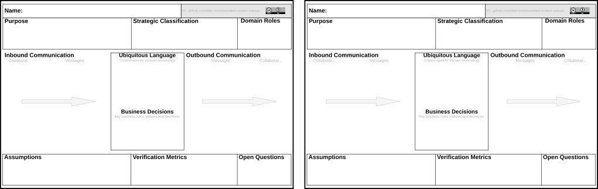

# Bounded Context Canvas how to

The *bounded context canvas* is described in [this blog post](https://medium.com/nick-tune-tech-strategy-blog/bounded-context-canvas-v2-simplifications-and-additions-229ed35f825f) by Nick Tune (highly recommended blog btw).

## Basic draw.io Usage

- Checkout this repository
- Head over to [lucid](https://lucid.app/lucidchart/) 
- Click on "More shapes"
- Click on "Import shapes"
- Pick "Add to existing library" alt. "Add to new library"
- Choose the `bounded-context-canvas-template.lucid.svg`

## Advanced Usage / Optional Prerequisites

Besides the website, there are several options available to use Lucidchart:

- [Lucidchart Diagrams for Confluence](https://lucid.co/marketplace/968addf8/confluence)
- [Use Lucidcharts diagrams in Google Docs](https://www.lucidchart.com/blog/how-to-make-diagrams-google-docs)

## Bounded Context Canvas How to

- Either continue from a canvas you already started or start from the `bounded-context-canvas-template.lucid.svg`.
- Fill it in with your team.
- Save the current file near the bounded context's code.
